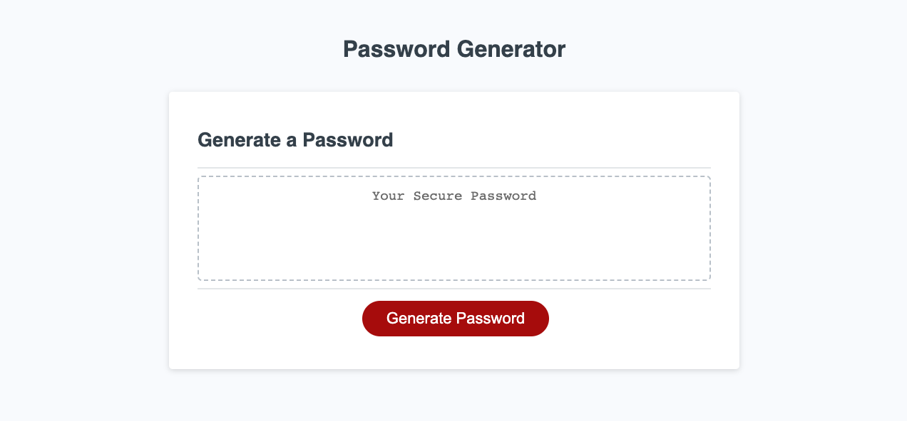

# Password Generator

## Description

The aim of this task was to generate the JavaScript logic to allow a user to pick out options for password generation. The following were the options avaialble for the user...

- The password must be between 10 and 64 characters
- The password must contain at least one or all of the below options
  - Uppercase letters
  - Lowercase letters
  - Numeric values
  - Special Characters

The user will click on the generate password button on the browser and will get a number of prompts asking the relavent options and then password will be generated within the browser.

## Mockup

The image below shows an image of the working application.

## Review

This was a great task to build on the JavaScript skills I have obtained and forced me to to think outside the box. Google was used to do some research where I learned how to achieve some of the functnality of this task.

## Deployment

[Password Generator Application - https://wmohammad83.github.io/password-generator/](https://wmohammad83.github.io/password-generator/)

## Resources Used

[Markdown Badges](https://github.com/Ileriayo/markdown-badges)

